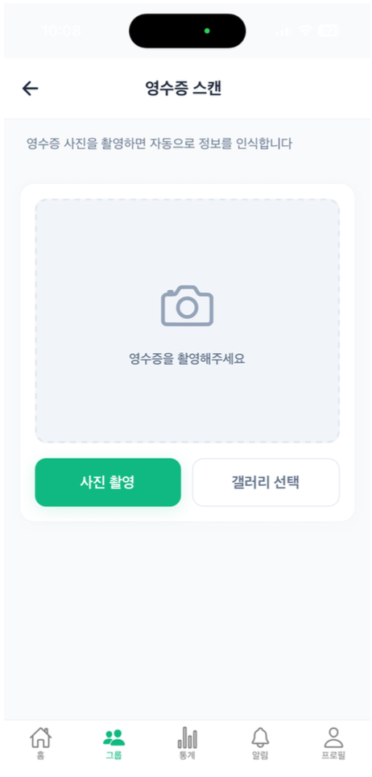
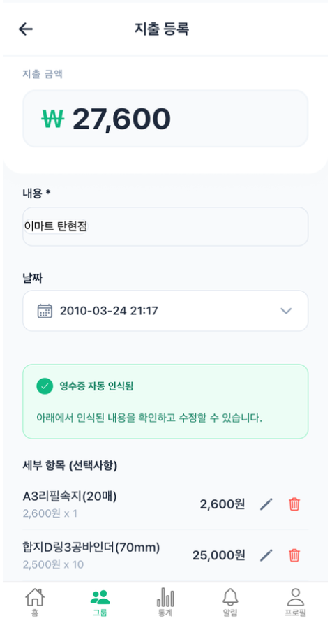
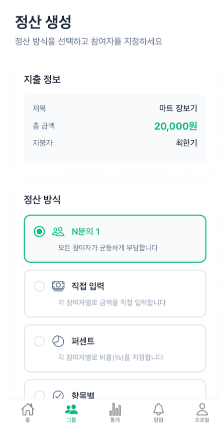
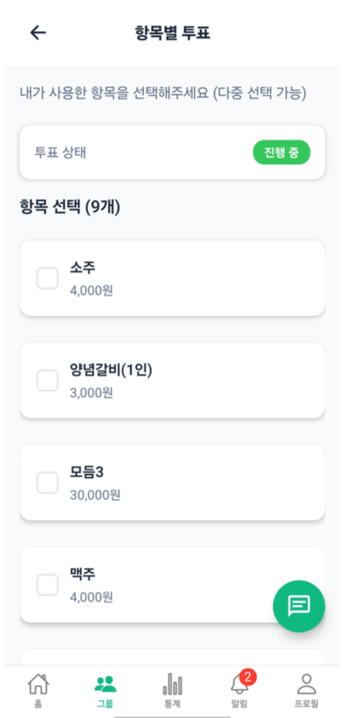
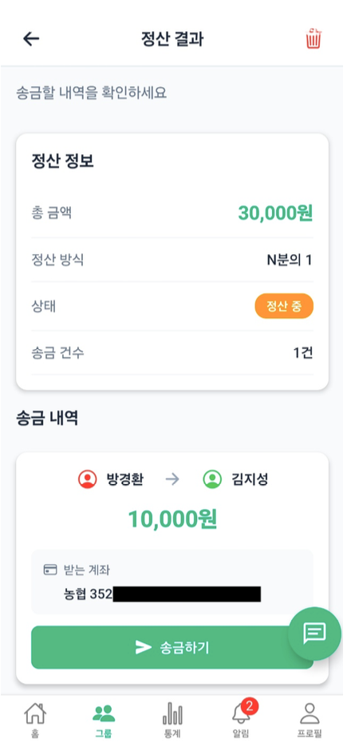
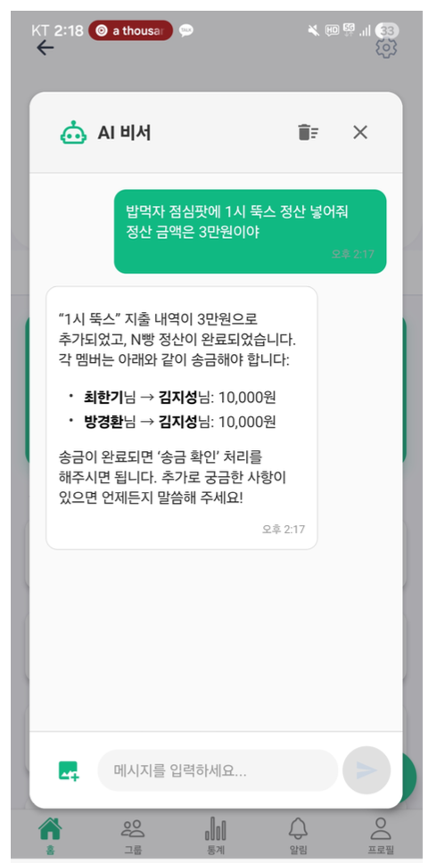
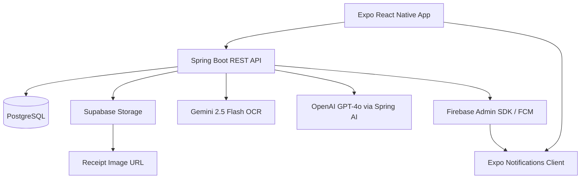
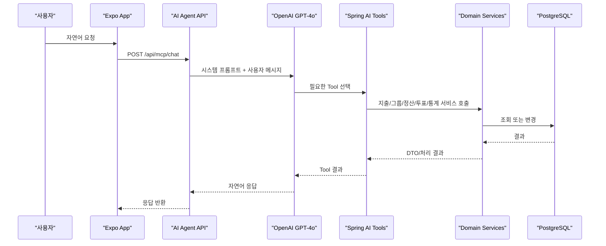

# 정총무

> 모임 지출부터 영수증 OCR, 참여자별 정산, 송금 확인까지 연결한 그룹 가계부 서비스

정총무는 여행, 회식, 동아리처럼 여러 사람이 함께 쓰는 돈을 그룹 단위로 기록하고 정산하는 모바일 앱입니다. 단순히 더치페이 금액을 계산하는 데서 끝나지 않고, 영수증 이미지 입력부터 지출 검증, 정산 방식 선택, 송금 확인, 알림과 통계까지 이어지는 흐름을 하나의 서비스로 묶었습니다.

현재 운영 서버는 유지하지 않습니다.

## 프로젝트 소개

| 항목 | 내용 |
| --- | --- |
| 기간 | 2025.09-2025.12 캡스톤디자인 |
| 형태 | 4인 팀 프로젝트, Expo React Native 앱 + Spring Boot API |
| 문제 | 모임 지출은 영수증 입력, 참여자 확인, 정산 방식 선택, 송금 완료 확인이 분리되어 있어 관리 비용이 큽니다. |
| 접근 | 영수증 OCR, 품목별 투표, 여러 정산 방식, 알림, 통계를 지출 도메인 흐름 안에 연결했습니다. |
| 역할 | 최한기: 팀장, 인프라/환경, 그룹, 알림<br>이선용: 지출 도메인, OCR 파이프라인, AI Agent<br>방경환: 로그인/인증, 통계<br>김지성: 정산, 투표 |

핵심 가치는 세 가지입니다.

- 영수증을 지출 등록 화면으로 연결해 수동 입력 부담을 줄입니다.
- N빵, 직접 입력, 비율, 항목별 투표 정산을 한 지출 도메인 위에서 처리합니다.
- AI Agent가 자연어를 해석해 기존 그룹, 지출, 정산, 투표, 통계 기능을 Tool Calling으로 실행합니다.

## 핵심 사용자 흐름

| 영수증 첨부 | OCR 기반 지출 입력 | 정산 방식 선택 |
| --- | --- | --- |
| <br>영수증을 촬영하거나 갤러리에서 선택합니다. | <br>OCR 결과로 채워진 제목, 금액, 날짜, 품목을 사용자가 확인하고 수정합니다. | <br>지출에 맞는 정산 방식과 참여자를 선택합니다. |

| 항목별 투표 | 정산 결과 | AI Agent |
| --- | --- | --- |
| <br>항목별 정산에서는 각자 사용한 품목을 선택합니다. | <br>참여자별 송금 대상과 금액을 확인하고 송금 확인을 처리합니다. | <br>자연어 요청을 기존 도메인 기능 실행으로 연결합니다. |

전체 화면 캡처는 [docs/screenshots.md](docs/screenshots.md)에 따로 정리했습니다.


## 핵심 구현

### 영수증 OCR 기반 지출 등록

**문제**

영수증의 품목, 수량, 금액을 직접 입력하면 항목 수가 늘어날수록 시간이 오래 걸리고 입력 오류가 발생하기 쉽습니다.

**해결**

`POST /api/ocr/scan`에서 이미지를 검증한 뒤 Supabase Storage에 업로드하고, 같은 이미지를 Gemini OCR로 분석해 지출 후보 데이터를 반환합니다. 프론트엔드는 OCR 결과를 지출 등록 화면의 초기값으로 채우고, 사용자가 수정한 뒤 지출 생성 API를 호출합니다.

**검증/안전장치**

- 백엔드 `ExpenseService`는 지출 생성/수정 시 `총액 == 품목 가격 * 수량 합계`를 검증합니다.
- 프론트 `OCRService.validateOcrResult`는 OCR 결과의 누락 필드와 총액/품목 합계 차이를 사용자에게 확인시킵니다.
- OCR 실패 시 지출 등록 화면의 직접 입력 경로를 사용할 수 있습니다.

**관련 코드**

- `backend/src/main/java/com/jeongchongmu/domain/OCR/OcrController.java`
- `backend/src/main/java/com/jeongchongmu/domain/OCR/service/GeminiOcrService.java`
- `backend/src/main/java/com/jeongchongmu/domain/OCR/service/SupabaseStorageService.java`
- `backend/src/main/java/com/jeongchongmu/domain/expense/ExpenseService.java`
- `frontend/src/screens/expense/OCRScanScreen.tsx`
- `frontend/src/screens/expense/CreateExpenseScreen.tsx`

### 다양한 정산 방식과 항목별 투표

**문제**

모임 정산은 항상 균등 분배로 끝나지 않습니다. 누군가는 특정 메뉴만 먹고, 어떤 경우에는 비율이나 직접 금액 입력이 필요합니다.

**해결**

정산 방식은 `SettlementMethod` enum으로 분리했고, `SettlementService.createSettlement`에서 방식별 계산 로직으로 분기합니다. 항목별 정산은 먼저 투표를 생성해 각 지출 품목을 선택지로 만들고, 투표 결과를 바탕으로 품목 금액을 참여자에게 나눠 배분합니다.

**검증/안전장치**

- 이미 정산이 생성된 지출은 중복 정산을 막습니다.
- 정산 참여자가 해당 그룹 멤버인지 검증합니다.
- 항목별 정산은 투표가 없으면 정산 생성을 중단합니다.

**관련 코드**

- `backend/src/main/java/com/jeongchongmu/settlement/service/SettlementService.java`
- `backend/src/main/java/com/jeongchongmu/settlement/enums/SettlementMethod.java`
- `backend/src/main/java/com/jeongchongmu/vote/service/VoteService.java`

### AI Agent Tool Calling

**문제**

지출 조회, 정산 생성, 투표 생성처럼 여러 화면을 오가야 하는 작업은 모바일 앱에서 조작 단계가 늘어납니다.

**해결**

`/api/mcp/chat` 엔드포인트는 Spring AI `ChatClient`와 OpenAI GPT-4o를 사용합니다. 사용자의 자연어 요청을 받은 뒤 `ExpenseAiTools`, `GroupAiTools`, `SettlementAiTools`, `VoteAiTools`, `StatisticsAiTools`, `DateTimeAiTools`, `OcrAiTools`를 Tool로 연결해 기존 도메인 서비스를 호출합니다.

**검증/안전장치**

- 인증 사용자의 ID를 `ToolContext`에 넣어 Tool에서 현재 사용자 기준으로 실행합니다.
- 시스템 프롬프트에 예시 ID 사용 금지, 조회 우선, 자동 정산 금지 규칙을 두었습니다.
- 삭제 작업은 사용자 재확인을 요구하도록 프롬프트에 제한을 둡니다.

**관련 코드**

- `backend/src/main/java/com/jeongchongmu/mcp/McpChatController.java`
- `backend/src/main/java/com/jeongchongmu/mcp/tools/ExpenseAiTools.java`
- `backend/src/main/java/com/jeongchongmu/mcp/tools/SettlementAiTools.java`
- `backend/src/main/java/com/jeongchongmu/mcp/tools/VoteAiTools.java`

### 권한 검증과 데이터 분리

**문제**

그룹 지출은 같은 서버에 저장되더라도 그룹 멤버가 아닌 사용자가 조회하거나 수정하면 안 됩니다.

**해결**

지출 조회는 그룹 멤버십을 확인한 뒤 수행하고, 수정/삭제는 지출 결제자 또는 그룹 OWNER만 허용합니다. 상세 조회에는 Fetch Join을 적용해 지출 품목, 참여자, 태그를 함께 가져옵니다.

**관련 코드**

- `backend/src/main/java/com/jeongchongmu/domain/expense/ExpenseService.java`
- `backend/src/main/java/com/jeongchongmu/domain/expense/Repository/ExpenseRepository.java`
- `backend/src/main/java/com/jeongchongmu/config/SecurityConfig.java`

### 알림 및 송금 확인

**문제**

정산 금액을 계산한 뒤에도 실제 송금 여부를 확인하지 않으면 정산 상태가 끝나지 않습니다.

**해결**

정산 생성, 투표 생성/완료, 정산 완료 시 알림을 DB에 저장하고 FCM으로 푸시합니다. 프론트는 Expo Notifications로 디바이스 토큰을 발급받아 서버에 등록합니다. 정산 상세에서는 Toss 딥링크로 송금 앱을 열고, 앱으로 돌아온 뒤 송금 확인 API를 호출해 `SettlementDetail.isSent`를 갱신합니다.

**관련 코드**

- `backend/src/main/java/com/jeongchongmu/domain/notification/service/NotificationService.java`
- `backend/src/main/java/com/jeongchongmu/domain/notification/service/ExpoPushService.java`
- `backend/src/main/java/com/jeongchongmu/config/FirebaseConfig.java`
- `backend/src/main/java/com/jeongchongmu/settlement/dto/SettlementDetailDto.java`
- `frontend/src/services/NotificationPermissionService.ts`
- `frontend/src/screens/settlement/SettlementDetailScreen.tsx`

## 시스템 아키텍처



### AI Agent 실행 흐름



## 기술 스택

| 영역 | 기술 |
| --- | --- |
| Backend | Java 21, Spring Boot 3.5.6, Spring Web, Spring Data JPA, Spring Security, Validation |
| Database | PostgreSQL, Flyway |
| Auth | JWT, BCrypt, Spring Security Filter Chain |
| AI/OCR | Spring AI OpenAI, GPT-4o, Gemini 2.5 Flash |
| Storage | Supabase Storage |
| Notification | Firebase Admin SDK, FCM, Expo Notifications |
| Frontend | Expo 54, React Native 0.81, React 19, TypeScript |
| UI/Navigation | React Navigation, React Native Paper, React Native SVG, React Native Chart Kit |
| Docs/Infra | Swagger/OpenAPI, Docker Compose |

## 담당 역할

초기 담당 영역을 기준으로 나누되, 후반 통합 과정에서는 서로의 도메인을 수정하고 보완했습니다.

### 최한기(choicold) | 팀장 · 인프라/환경 · 그룹 · 알림

- 팀장으로 전체 개발 흐름을 관리하고, 초기 프로젝트 구조와 백엔드/프론트 환경 세팅을 주도
- Docker Compose, Railway 배포 설정, GitHub Actions, 환경 변수 예시, Spring 설정 등 인프라 기반 구성
- 그룹/그룹멤버 엔티티, Repository, Service, Controller와 그룹 생성/가입/멤버 관리 흐름 구현
- 그룹 도메인 Repository/Service 테스트와 H2 테스트 의존성, Flyway 스키마 정리 작업 수행
- Firebase Admin SDK, FCM/Expo Push, 알림 저장/조회/전송 흐름과 알림 화면 라우팅 구현 및 보완
- 프론트 공통 컴포넌트, 주요 화면 골격, API 클라이언트/타입 정의, 빌드 설정 등 앱 전반 통합
- 대시보드 통합 API와 통계 쿼리 성능 개선, 지출/정산/투표/알림 연동 오류 수정

### 이선용(nametwo/twoname) | 지출 도메인 · OCR 파이프라인 · AI Agent

- 지출 생성, 수정, 삭제, 조회와 그룹 멤버십/수정 권한 검증 구현
- 지출 품목 합계와 총액 일치 검증 로직 구현
- 영수증 업로드, Supabase Storage 저장, Gemini OCR 응답 파싱 흐름 연결
- 자연어 요청을 기존 지출/정산/투표/통계 기능으로 연결하는 Tool Calling 구조 구성
- 인증 사용자 기준의 지출 조회와 상세 조회 API 구현
- Spring AI 기반 Agent API와 `ExpenseAiTools`, `SettlementAiTools`, `VoteAiTools`, `StatisticsAiTools` 등 도구 호출 계층 구현
- 정산/투표 권한 검증, 마감 이후 투표 제한, 정산 계산 일부 에지 케이스 보완

### 방경환(Bangkyunghwan) | 로그인/인증 · 통계

- 회원가입, 로그인, JWT 인증 시스템과 인증 필터/유틸, Security 설정 구현
- 사용자 도메인의 Controller, Service, Repository, 요청/응답 DTO 기반 구성
- 회원가입 시 은행명/계좌번호 입력 흐름과 서버 내부 에러 핸들러 보완
- 그룹별 통계표 API 구현 및 정산/투표 기능과 통계 기능 사이의 충돌 해결
- 초기 프론트 작업과 인증/통계 화면 연동 기반 작업 참여

### 김지성(Kjs-ssu / Kim Ji Seong) | 정산 · 투표

- 정산 엔티티, 정산 상세 엔티티, 정산 방식/상태 enum과 요청/응답 DTO 설계
- `SettlementController`, Repository, Service 기반의 정산 생성/조회 흐름 구현
- N빵, 직접 입력, 비율, 항목별 정산을 처리하는 계산 로직의 초기 구현
- 투표 도메인과 항목별 정산 연결, 투표 생성/참여/결과 확인 흐름 구현
- 그룹/지출 도메인과 정산·투표 기능 연결, API 수정과 프론트 보완 작업 참여

### 역할 요약

| 이름 | 주 담당 | 커밋 기준 보완 기여 |
| --- | --- | --- |
| 최한기 | 팀장, 인프라/환경, 그룹, 알림 | 프론트 골격, 대시보드/통계 최적화, 지출/정산/투표 통합 수정 |
| 이선용 | 지출 도메인, OCR 파이프라인, AI Agent | 정산/투표 Tool Calling, 권한 검증과 계산 에지 케이스 보완 |
| 방경환 | 로그인/인증, 통계 | 회원 정보 확장, 서버 에러 처리, 초기 프론트 작업 |
| 김지성 | 정산, 투표 | 그룹/지출 연동, API 수정, 프론트 보완 |

## 대표 API

| 영역 | 엔드포인트 | 역할 |
| --- | --- | --- |
| 지출 | `POST /api/expenses` | 지출, 품목, 참여자, 태그 생성 |
| 지출 | `GET /api/expenses?groupId={id}` | 그룹 지출 목록 조회 |
| OCR | `POST /api/ocr/scan` | 영수증 이미지 업로드 및 OCR 분석 |
| 정산 | `POST /api/settlements` | N빵, 직접, 비율, 항목별 정산 생성 |
| 정산 | `POST /api/settlements/{id}/confirm-transfer` | 송금 완료 확인 |
| 투표 | `POST /api/votes/{expenseId}` | 항목별 정산 투표 생성 |
| AI Agent | `POST /api/mcp/chat` | 자연어 요청 처리 및 Tool Calling |

전체 API는 백엔드 실행 후 Swagger UI에서 확인할 수 있습니다.

```text
http://localhost:8080/swagger-ui/index.html
```

## 핵심 코드 경로

| 경로 | 봐야 하는 이유 |
| --- | --- |
| `backend/src/main/java/com/jeongchongmu/domain/expense/ExpenseService.java` | 지출 생성, 총액/품목 합계 검증, 멤버십과 수정/삭제 권한 검증이 모여 있습니다. |
| `backend/src/main/java/com/jeongchongmu/domain/OCR/service/GeminiOcrService.java` | Gemini OCR 프롬프트, 응답 정리, JSON 파싱 흐름을 확인할 수 있습니다. |
| `backend/src/main/java/com/jeongchongmu/domain/OCR/service/SupabaseStorageService.java` | 영수증 이미지를 Supabase Storage에 저장하고 Public URL을 생성합니다. |
| `backend/src/main/java/com/jeongchongmu/settlement/service/SettlementService.java` | N빵, 직접, 비율, 항목별 투표 정산 계산과 송금 완료 처리가 구현되어 있습니다. |
| `backend/src/main/java/com/jeongchongmu/vote/service/VoteService.java` | 지출 품목을 투표 선택지로 만들고, 사용자 투표를 토글 처리합니다. |
| `backend/src/main/java/com/jeongchongmu/mcp/McpChatController.java` | AI Agent 엔드포인트, 시스템 프롬프트, Spring AI Tool 연결을 확인할 수 있습니다. |
| `backend/src/main/java/com/jeongchongmu/mcp/tools/SettlementAiTools.java` | 자연어 정산 요청이 실제 정산 서비스 호출로 이어지는 Tool 정의입니다. |

## 프로젝트 구조

```text
backend/
  src/main/java/com/jeongchongmu/
    user/                         # 회원가입, 로그인, 프로필, FCM 토큰
    domain/group/                 # 그룹과 그룹 멤버
    domain/expense/               # 지출, 품목, 참여자, 태그
    domain/OCR/                   # 영수증 업로드와 OCR
    settlement/                   # 정산과 송금 확인
    vote/                         # 항목별 투표
    statistics/                   # 월별/카테고리별 통계
    domain/notification/          # 알림 저장과 푸시 발송
    mcp/                          # AI Agent API와 Tool 정의
    common/                       # JWT, 예외 처리, 공통 엔티티

frontend/
  src/
    screens/                      # 앱 화면
    components/                   # 공통 UI, 지출, 정산, 투표 컴포넌트
    services/api/                 # 백엔드 API 클라이언트
    hooks/                        # 통계, 대시보드, AI 채팅, 알림 훅
    navigation/                   # React Navigation 구성
    context/, contexts/           # 인증, 알림, 토스트, 데이터 컨텍스트

docs/
  images/readme/                  # README와 화면 문서에 쓰는 캡처
  screenshots.md                  # 전체 화면 캡처 모음
```

## 실행 방법

### 1. 환경 변수 준비

루트의 `.env.example`을 참고해 로컬 환경 변수를 설정합니다. 실제 키와 인증 JSON은 커밋하지 않습니다.

필수에 가까운 값:

- PostgreSQL: `POSTGRES_DB`, `POSTGRES_USER`, `POSTGRES_PASSWORD`, `DB_HOST`, `DB_PORT`, `DB_NAME`, `DB_USERNAME`, `DB_PASSWORD`
- AI/OCR: `OPENAI_API_KEY`, `GOOGLE_API_KEY`
- Storage: `SUPABASE_URL`, `SUPABASE_KEY`
- Notification: `FIREBASE_CREDENTIALS_JSON` 또는 `FIREBASE_CREDENTIALS_PATH`
- Frontend: `EXPO_PUBLIC_API_URL`

AI/OCR 키가 없으면 관련 기능은 정상 동작하지 않습니다. 로컬에서 백엔드 기동만 확인하려면 환경 변수에 더미 값을 넣어 placeholder 해석 오류를 피하고, 실제 OCR/AI Agent 호출은 유효한 키를 설정한 뒤 확인해야 합니다. Firebase 인증 정보가 없으면 서버는 실행되지만 푸시 알림 전송은 비활성화됩니다.

### 2. 로컬 DB 실행

```bash
docker-compose up -d
```

### 3. 백엔드 실행

```bash
cd backend
./gradlew bootRun
```

### 4. 프론트엔드 실행

```bash
cd frontend
npm install
EXPO_PUBLIC_API_URL=http://localhost:8080 npm start
```

실기기에서 테스트할 때는 `localhost` 대신 같은 네트워크의 개발 PC IP를 사용해야 합니다.

## 문서 및 참고 자료

- 전체 화면 캡처: [docs/screenshots.md](docs/screenshots.md)
- 프론트 API 매핑 문서: [frontend/docs/api_mapping.md](frontend/docs/api_mapping.md)
