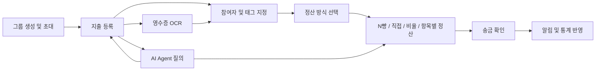
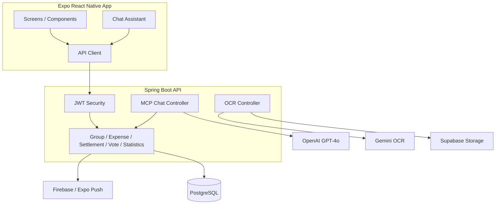

# 정총무

> 2025.09-12 캡스톤디자인 프로젝트<br>
> 모임 지출 기록, 영수증 OCR, 참여자별 정산, 송금 확인까지 연결하는 그룹 가계부 서비스

정총무는 여행, 동아리, 회식처럼 여러 사람이 함께 쓰는 돈을 그룹 단위로 기록하고 정산하는 모바일 앱입니다. 지출 등록, 영수증 OCR, 품목별 투표, N빵/직접/비율/항목별 정산, 푸시 알림, 월별 통계, AI Agent를 하나의 흐름으로 묶어 "누가 무엇에 참여했고 얼마를 보내야 하는지"를 관리합니다.

현재 운영 서버는 내려간 상태이며, 앱 동작 기록은 캡스톤 결과 보고서를 참고합니다.

## 서비스 흐름



## 주요 기능

| 영역 | 기능 |
| --- | --- |
| 그룹 관리 | 그룹 생성, 초대 코드 발급, 코드 기반 가입, 멤버 조회, 탈퇴 및 강퇴 |
| 지출 관리 | 지출 생성/수정/삭제/조회, 참여자 지정, 태그 관리, 총액과 품목 합계 검증 |
| 영수증 OCR | 이미지 업로드, Supabase Storage 저장, Gemini 기반 영수증 텍스트 및 품목 추출 |
| 정산 | N빵, 직접 입력, 비율, 항목별 투표 기반 정산 생성 및 송금 완료 처리 |
| 투표 | 지출 품목별 투표 생성, 항목 선택/취소, 투표 현황 조회 |
| 통계 | 월별 지출, 카테고리별 지출, 정산 요약, 주요 지출 조회 |
| 알림 | Expo Push Notification 기반 알림 조회 및 읽음 처리 |
| AI Agent | 자연어 요청을 기존 그룹, 지출, 정산, 투표, 통계 기능과 Tool Calling으로 연결 |

## 기술 스택

| 영역 | 기술 |
| --- | --- |
| Backend | Java 21, Spring Boot 3.5.6, Spring Web, Spring Data JPA, Spring Security, Validation |
| Database | PostgreSQL, Flyway |
| Auth | JWT, Spring Security |
| AI/OCR | Spring AI OpenAI GPT-4o, Gemini 2.5 Flash OCR |
| Storage | Supabase Storage |
| Notification | Firebase Admin SDK, Expo Push Notification |
| Frontend | Expo 54, React Native 0.81, React 19, TypeScript |
| UI/Navigation | React Navigation, React Native Paper, React Native SVG, Chart Kit |
| API Docs | Swagger/OpenAPI |
| Local Infra | Docker Compose PostgreSQL |

## 아키텍처 개요



## API 영역

| 영역 | 대표 엔드포인트 |
| --- | --- |
| 사용자 | `POST /api/user/signup`, `POST /api/user/login`, `GET /api/user/profile` |
| 그룹 | `POST /api/groups`, `GET /api/groups`, `POST /api/groups/join`, `GET /api/groups/{groupId}/members` |
| 지출 | `POST /api/expenses`, `GET /api/expenses?groupId=`, `GET /api/expenses/{id}`, `PATCH /api/expenses/{id}`, `DELETE /api/expenses/{id}` |
| OCR | `POST /api/ocr/scan` |
| 정산 | `POST /api/settlements`, `GET /api/settlements/{settlementId}`, `GET /api/settlements/by-expense/{expenseId}`, `POST /api/settlements/{settlementId}/confirm-transfer` |
| 투표 | `POST /api/votes/{expenseId}`, `POST /api/votes/cast`, `GET /api/votes/{expenseId}`, `DELETE /api/votes/{expenseId}` |
| 통계 | `GET /api/groups/{groupId}/statistics`, `GET /api/statistics` |
| 알림 | `GET /api/notifications`, `PATCH /api/notifications/{notificationId}/read` |
| AI Agent | `POST /api/mcp/chat` |

## 핵심 코드 경로

| 코드 | 경로 | 역할 |
| --- | --- | --- |
| ExpenseService | `backend/src/main/java/com/jeongchongmu/domain/expense/ExpenseService.java` | 지출 생성/수정/삭제/조회, 총액-품목 합계 검증, 그룹 멤버십 및 권한 검증 |
| ExpenseRepository | `backend/src/main/java/com/jeongchongmu/domain/expense/Repository/ExpenseRepository.java` | 지출 상세 조회용 Fetch Join 쿼리 |
| SettlementService | `backend/src/main/java/com/jeongchongmu/settlement/service/SettlementService.java` | 정산 생성, 조회, 수정, 삭제, 송금 완료 처리 |
| VoteService | `backend/src/main/java/com/jeongchongmu/vote/service/VoteService.java` | 항목별 투표 생성, 투표 반영, 투표 현황 조회 |
| GeminiOcrService | `backend/src/main/java/com/jeongchongmu/domain/OCR/service/GeminiOcrService.java` | Gemini 기반 영수증 OCR 요청, 응답 정리, JSON 파싱 |
| SupabaseStorageService | `backend/src/main/java/com/jeongchongmu/domain/OCR/service/SupabaseStorageService.java` | 영수증 이미지 업로드 및 Public URL 생성 |
| McpChatController | `backend/src/main/java/com/jeongchongmu/mcp/McpChatController.java` | AI Agent 채팅 엔드포인트, 시스템 프롬프트, Tool Calling 연결 |
| ExpenseAiTools | `backend/src/main/java/com/jeongchongmu/mcp/tools/ExpenseAiTools.java` | 자연어 기반 지출 생성, 수정, 삭제, 조회 Tool |
| SettlementAiTools | `backend/src/main/java/com/jeongchongmu/mcp/tools/SettlementAiTools.java` | 자연어 기반 정산 생성, 조회, 삭제, 송금 확인 Tool |
| DateTimeAiTools | `backend/src/main/java/com/jeongchongmu/mcp/tools/DateTimeAiTools.java` | 날짜, 기간, 월 정보 계산 Tool |
| ChatAssistant | `frontend/src/components/common/ChatAssistant.tsx` | 앱 내 AI Agent 채팅 UI |

## 프로젝트 구조

```text
backend/
  src/main/java/com/jeongchongmu/
    user/                         # 회원가입, 로그인, 프로필, FCM 토큰
    domain/group/                 # 그룹과 그룹 멤버
    domain/expense/               # 지출, 품목, 참여자, 태그
    domain/OCR/                   # 영수증 업로드와 OCR
    settlement/                   # 정산과 송금 확인
    vote/                         # 항목별 투표
    statistics/                   # 월별/카테고리별 통계
    domain/notification/          # 알림
    mcp/                          # AI Agent 엔드포인트와 Tool 정의
    common/                       # JWT, 예외 처리, 공통 엔티티

frontend/
  src/
    screens/                      # 앱 화면
    components/                   # 공통 UI, 지출, 정산, 투표 컴포넌트
    services/api/                 # 백엔드 API 클라이언트
    hooks/                        # 통계, 대시보드, AI 채팅, 알림 훅
    navigation/                   # React Navigation 구성
    contexts/                     # 인증, 알림, 토스트, 데이터 컨텍스트
```

## 로컬 실행

### 1. 환경 변수 설정

`backend/src/main/resources/application.yml`과 `docker-compose.yml`에서 사용하는 값을 실행 환경에 설정합니다.

```bash
SPRING_PROFILE=local
SERVER_PORT=8080

POSTGRES_DB=jeongchongmu
POSTGRES_USER=admin
POSTGRES_PASSWORD=password

DB_HOST=localhost
DB_PORT=5432
DB_NAME=jeongchongmu
DB_USERNAME=admin
DB_PASSWORD=password

OPENAI_API_KEY=...
GOOGLE_API_KEY=...
SUPABASE_URL=...
SUPABASE_KEY=...
```

### 2. DB 실행

```bash
docker-compose up -d
```

### 3. 백엔드 실행

```bash
cd backend
./gradlew bootRun
```

### 4. 프론트엔드 실행

```bash
cd frontend
npm install
npm start
```

Expo Go, Android/iOS 시뮬레이터, 또는 Expo web으로 앱을 확인할 수 있습니다. 기본 API 주소는 `frontend/src/constants/config.ts`의 `API_CONFIG.BASE_URL`에서 관리합니다.

## 팀 구성

| 이름 | 담당 영역 |
| --- | --- |
| 이선용 | 지출 도메인, OCR 파이프라인, AI Agent |
| 최한기 | 그룹, 알림, 프론트 |
| 김지성 | 정산, 투표 |
| 방경환 | 로그인, 통계, 프론트 |
