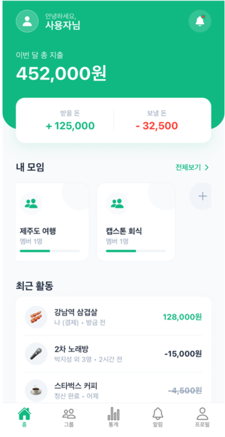
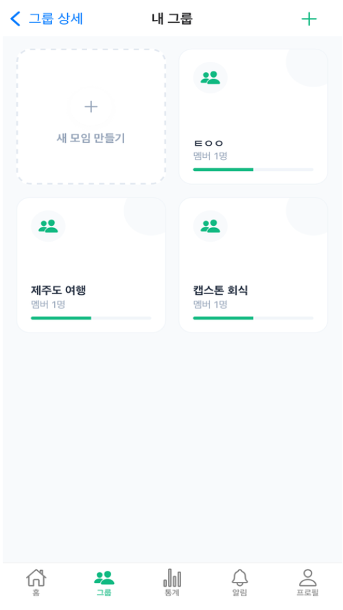
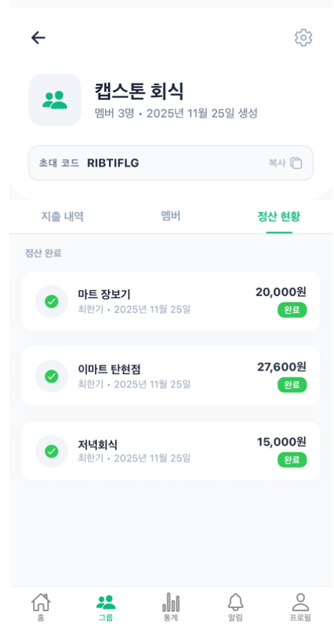
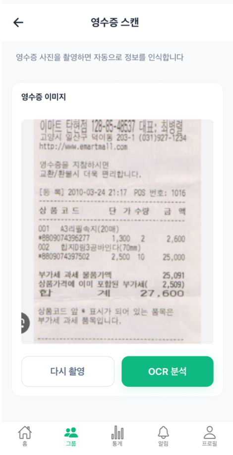
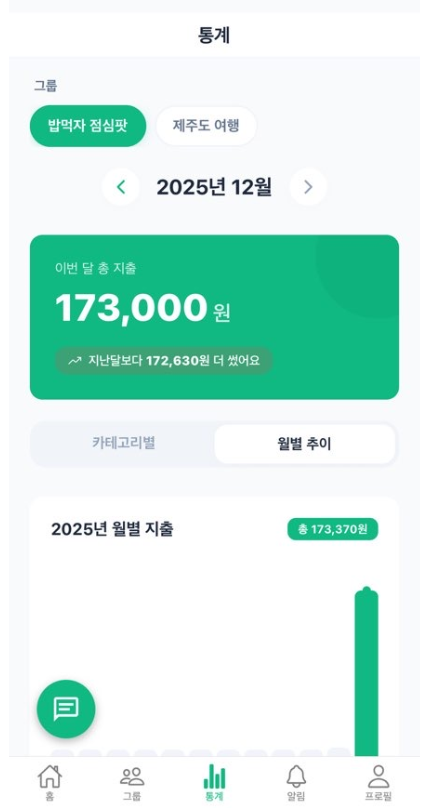
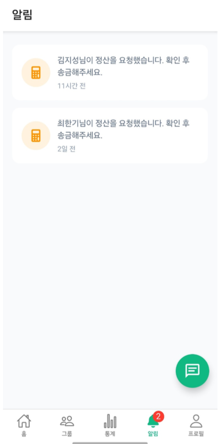

# 정총무 화면 캡처

캡스톤 최종보고서의 결과 화면 캡처를 README용 이미지로 정리한 문서입니다. README 본문에는 핵심 흐름만 배치하고, 전체 화면은 이 문서에서 확인할 수 있습니다.

## 서비스 진입과 그룹

| 홈 | 그룹 목록 | 그룹 상세 |
| --- | --- | --- |
|  |  |  |

## OCR 기반 지출 등록

| 영수증 첨부 | OCR 분석 | 지출 정보 확인 |
| --- | --- | --- |
|  |  |  |

## 정산과 투표

| 정산 생성 | 항목별 투표 | 정산 결과 |
| --- | --- | --- |
|  |  |  |

## 통계, 알림, AI Agent

| 지출 통계 | 알림 | AI Agent |
| --- | --- | --- |
|  |  |  |
